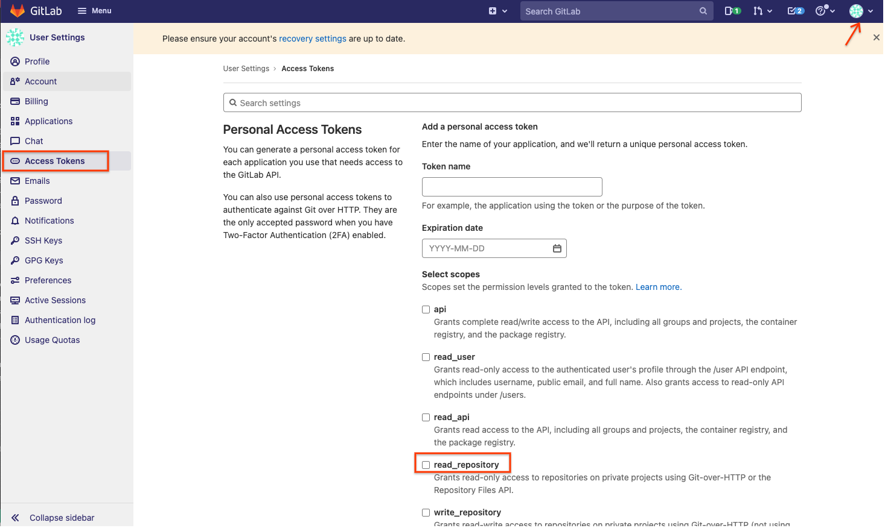

# Overview

This project is an opinionated installation of Anthos Bare Metal and several
Google Cloud Platform tools designed specifically for Consumer Edge
requirements.

This project is a group of Ansible playbooks and bash scripts that are used to
provision and manage Anthos bare metal instances given a hardware or cloud
inventory.

There are two deployment target types: **Hardware** and **Cloud**. Both
deployment types can co-exist, but are not in the same network space by default.

## TL;DR

There are three phases to installing Consumer Retail Edge

1. Setup baseline compute machines - Create and setup the underlying machines
to be ready for provisioning
1. Provision inventory - Provision/install Consumer Edge onto the baseline
compute maachines
1. Verify installation - Login to one of the machines and perform `kubectl` and
other tool operations

### Terms to know

> **Target machine**

*The machine that the cluster is being installed into/onto
(i.e., NUC, GCE, etc). This is often called the "host" in public
documentation.*

> **Provisioning machine**

*The machine that initiates the `ansible` run. This is typically a laptop or the
cloud shell within the GCP console.*

---

## Quick Start - 1. Setup Baseline Compute

This **Quick Start** will use GCE instances to simulate physical hardware and
utilize VXLAN overlays to simulate L2 networking support.

Please perform the following sequence of events:

1. Install docker and other components needed on the **provisioning machine** (your machine, a cloud-top, or a GCE VM
    etc)

    ```bash
    ./setup.sh
    ```

1. This project uses Personal Access Tokens (PATs) for ACM's authentication of
    the `root-repo`. [Create a new PAT token](https://docs.gitlab.com/ee/user/project/deploy_tokens/)
    and save the credentials for the steps below. 
    1. Go to user **Preferences** on the top right corner. On the left menu, select **Access Tokens**
    2. Choose a "Token name" name that will be used later in this installation as an environment variable
        **SCM_TOKEN_USER**.
    3. Create the PAT with **read_repository** privilege.
    4. The produced token value that will be uesd later in this installation as an environment variable
        **SCM_TOKEN_TOKEN**.

## SSH Key Management

The playbooks in this repo contain a set of pre-tasks that take care of
downloading the SSH private key form secret manager that is used to access remote machines.

All of this will happen automatically when you launch the `create-gsa.sh`
in the next steps.

In order to enable dynamically loading the SSH private key during runtime, you
will need to make sure that `ssh-agent` is running prior to running a playbook.


## Installation Stages
1. Install or verify `gettext` is installed on the **provisioning machine**.
Run `which envsubst` and if this fails, follow the below steps to install
`gettext` binary

    * MacOS with Ports
      ```bash
      # MacOS + Ports
      sudo port install gettext
      ```

    * MacOS with Homebrew
      ```bash
      # MacOS + Brew
      brew install gettext
      brew link --force gettext
      ```

    * Debian/Ubuntu
      ```bash
      sudo apt install gettext
      ```

1. Make sure you are authenticated with your Google Cloud account on the provisioning machine
   and set the default working project
    ```
    gcloud auth login --no-launch-browser
    gcloud config set project <<your_project_id>>
    ```


1. Create Google Cloud Service Accounts used for provisioning and for the nodes. Skip this step if
you have a properly authenticated GSA keys:
   * Provisioning GSA located at `./build-artifacts/provisioning-gsa.json`
   * Node GSA located at `./build-artifacts/node-gsa.json`

    **Note:** The following helper script will create both GSA, but it will only create one provisioning and node keypair per project as it does not generate unique names per cluster.
    ```bash
    # Follow prompts, answer YES to generate a new key when prompted
    ./scripts/create-gsa.sh
    ```
    What this does:
    * Creates provisioning GSA and key at `./build-artifacts/provisioning-gsa.json`
    * Creates node GSA and key at `./build-artifacts/node-gsa.json`

1. Create SSH keypair for communication between **provisioning machine** and **target machines**.

1. If ssh key was already created and is not present locally then download the private key from secret manager. Substitute cluster_name with name of your custer like cnuc-1

    ```bash
    gcloud secrets versions \
    access latest --secret="ssh-priv-key-cluster_name" >> build-artifacts/consumer-edge-machine 
    ```

1. Otherwise create new SSH keypair from scratch
      ```bash
      ssh-keygen -N '' -o -a 100 -t ed25519 -f ./build-artifacts/consumer-edge-machine
      ```
1. Upload the ssh private key into secret manager. Substitute cluster_name with name of your custer like cnuc-1
      ```bash
      gcloud secrets create ssh-priv-key-cluster_name --replication-policy="automatic"
      gcloud secrets versions add ssh-priv-key-cluster_name --data-file="build-artifacts/consumer-edge-machine"
      ```
1. Export the necessary environment variables

    ```sh
    export PROJECT_ID=<GCP_PROJECT_TO_USE>
    export REGION=<GCP_REGION_TO_USE>
    export ZONE=<GCP_ZONE_TO_USE>
    ```

    1. (Optional) Set the follwing variables only if the `ROOT_REPO_TYPE` used is `token`

    ```sh
    export SCM_TOKEN_USER=<GITLAB_USERNAME>
    export SCM_TOKEN_TOKEN=<GITLAB_PERSONAL_ACCESS_TOKEN>
    ```

2. Create configuration file (`.envrc`)

    ```bash
    # Create a default .envrc file (dot-file)
    envsubst '$PROJECT_ID'  < templates/envrc-template.sh > .envrc
    ```

    1. Validate if the correct values have been replaced for the variables in the
        generated `.envrc` file

    1. Instantiate `ENV` variables inside current shell. Run `source` on the
    `.envrc` file to expose variables (advanced users can use `direnv` if
    installed and configured)

        ```bash
        source .envrc
        ```

1. Create GCE baseline instances; the quick start uses GCE intances to emulate
Intel 11 NUCs (8c/16t, 64GB RAM and 250GB storage).

    ```bash
    # Create 3 GCE instances w/ embedded init-script
    ./scripts/cloud/create-cloud-gce-baseline.sh -c 3
    ```

    > NOTE: Instance type defaults to `n1-standard-16`, stay within the `n1` or
     `n2` family due to hypervisor access visibility inside the OS. Restart the
     VMs. The vxlan not assigning sometimes to the first run of cnucs.

1. Setup RobinIO secret if Robin is chosen as the SDS provider (this is the default)

    1. Go to marketplace, search for "robin", select and enable robin
    1. Create a Google Secret named "robin-sds-license"
    1. Contents of that secret is a JSON blob in the following format:

        ```json
        {
          "consumer-id": "project:pr-xxxddddd-change-me",
          "entitlement-id": "xxxxxxxx-2450-4dca-9abe-b8-change-me",
          "reporting-key": "ewogICJ0eXBlIjogInNl...change-me..."
        }

## Quick Start - 2. Provision Inventory

In this phase, the compute machines have been created and a baseline has been
established (ie: users created, minimal dependencies and public keys have been
added to **target machines**). Now it is time to run `ansible`.

This phase involves the creation of a Docker provisioning image, inventory
configuration settings and running the provisioning.

1. Creating and instantiating a `docker` provisioning image. A detailed
explanation can be found in the [Docker build details](docker-build/README.md)
file.

    ```bash
    gcloud builds submit --config ./docker-build/cloudbuild.yaml .
    ```

1. Create "inventory" file for Ansible provisioning

    ```bash
    envsubst < templates/inventory-cloud-example.yaml > inventory/gcp.yml
    ```

1. Upon completion, it's time to provision! Run the following and answer 'y'
when propmted. This command will enter into the Docker image shell to run
commands, do not `exit` until completed.

    ```bash
    ./install.sh
    ```

    > NOTE: Depending on your terminal configuration, it might be hard to see,
    but there are a few commands that you will need to run once you are inside the
    container. Keep an eye on the output of the script for instructions.

1. Go get coffee, it can take 20-40 minutes to perform a full provsion

1. If you completed with all 3 machines still in scope and no failures, you now
have a fully provisioned Consumer Edge cluster!


## Quick Start - 3. Verifying

At this point cluster creation should be complete and visible in the
`Kubernetes Engine` and `Anthos` menus of GCP Console under `cnuc-1`. The quick
start **does not** use OIDC (yet), so you will not be able to see the workloads
and services of the cluser until you `login`. To do this, a token needs to be
generated and cut-copy-pasted into the `Token` prompt of the login screen.

1. From within the Docker shell (if previously exited, run `./install.sh` again)

    ```bash
    ansible-playbook all-get-login-tokens.yml -i inventory
    ```

    * Cut/Copy-paste the token for `cnuc-1`

1. From the GCP console, click on the three vertical dots (menu) for the
`cnuc-1` cluster and select `Login`

1. Select "Token" and paste in the value obtained from the previous command and
submit

1. Workloads and services should now show up within the console as though it
were a normal GKE cluster

1. Optional, logging in and running `kubectl` and `k9s` commands can be
performed using SSH.
    * Run `./scripts/gce-status.sh` to produce the SSH commands for logging
    into each of the 3 machines
      ```bash
      ssh -F ./build-artifacts/ssh-config cnuc-1
      ```
    * Run commands on machine, the user will be `abm-admin`

      ```bash
      kubectl get nodes
      ```
    * `exit` to return to Docker shell

## Glossary

### Provisioning target types

> **Hardware**

*Scripts and Playbooks designed to deploy onto hardware servers
meeting requirements.*

*In this project, all hardware machines will have `nuc` or `edge` as a
prefixes on their hostname and variable names.*

> **Cloud**

*Scripts and Playbooks designed to be deployed into GCE Virtual
Machines.*

*In this project, all cloud machines will have `cnuc` as a prefix for hostname
and variable names.*
