# Overview

This document outlines how to use the provided Docker image to build and provision an instance of Consumer Edge.

Docker was chosen to provide a more developer friendly installation and provisioning process that does not require a provisioning machine to install Ansible.

You simply need to follow the 5 steps outlined below to run a Cloud or Physical instance(s) of Consumer Edge.

## Installation

There are 6 primary steps to fully install and manage an instance of Consumer Edge. Follow each of the below sections in sequence and pay attention to "exit criteria" to ensure you passed each stage.


[View full installation flowchart](FULL_INSTALL_DIAGRAM.md)

## 1. Get the repo

In this section you will clone this repository and setup a Personal Access Token (PAT) in GitLab so the instances can reference a pre-fabricated Anthos Config Management Root and Namespace repository. If you have already established a PAT, you can re-use those value as long as they are active and functional.


1. Clone or fork this repo. All commands and scripts are run in the context of the repo root directory.

    ```bash
    git clone git@gitlab.com:gcp-solutions/app-mod/sm002-consumer-edge/consumer-retail-edge/abm-consumer-edge-ansible.git
    ```

1. Change directory into the new repo

    ```bash
    cd abm-consumer-edge-ansible
    ```

1. Anthos Config Management uses `Token` as one of the GitOps Repo Authentication methods. This solution stores Personal Access Tokens (PAT) as Kubernetes Secrets to satisfy the ACM configuration. Please create a [Personal Access Token](https://docs.gitlab.com/ee/user/profile/personal_access_tokens.html#create-a-personal-access-token) with your GitLab account with the `read-repository` access only. The **username** and **token** values are stored in the `.envrc` file a few steps ahead of this one.  Use the link below to pre-fill a PAT or follow instructions in the link above.

    > Quick-link w/ pre-filled out fields: https://gitlab.com/-/profile/personal_access_tokens?name=consumer-edge-user&scopes=read_repository

    > :bangbang: For simplicity, use `consumer-edge-user` as your **username** and take note of the **token**


## 2. Setup, Configure & Customize

In this section, you will create SSH keys for authentication to machines, create customized configuration via an Environment Variables file and setup a Google Service Account to delegate Google commands through. IF you have completed any of these steps, you can re-use the existing component as long as the permissions and functionality have not changed (ie, you did not change the GSA permissions or ENV vars still reference appropriate values).


1. Create SSH Key-pair

    1. Consumer Edge requires password-less access to each of the machines, and this requires asymmetric keys to be established for SSH communication. [OpenSSH](https://www.openssh.com/) is used to manage keys and SSH configuration, so if you do not have OpenSSH installed, please setup per your OS (ie: Mac - https://ports.macports.org/port/openssh/, Debian/Ubuntu - https://howtoinstall.co/en/openssh-client)

        ```bash
        # Verify you have OpenSSH by typing
        which ssh-keygen
        # should return something like /usr/bin/ssh-keygen ...if not, please install openssh-client
        ```

    1. Create (or use an existing) asymmetric key-pair to SSH into all inventory.
    NOTE: the names of the keys below are defaults, so if you want to use different names, you will need to adjust ENV variables to match (not recommended).

        > :warning: **DO NOT** use a passphrase, if prompted, just hit [enter]

        ```bash
        # Create an SSH key-pair into ./build-artifacts folder
        ssh-keygen -t ed25519 -f ./build-artifacts/consumer-edge-machine -q -N ""
        ```

        Verify by echoing the public key.

        ```bash
        cat ./build-artifacts/consumer-edge-machine.pub
        ```

1. Create a Google Service Account

    1. Install, update and authenticate `gcloud` [Installation Quick Start](https://cloud.google.com/sdk/docs/quickstart)

        ```bash
        # Verify by typing
        gcloud version
        ```

    1. Create Google Service Account (GSA) and place the JSON keys at `build-artifacts/provisioning-gsa.json` and `build-artifacts/node-gsa.json`. Use the helper script located at `scripts/create-gsa.sh`. Follow the prompts to create new GSA Keys **if** you don't have tehm defined, or if you want to use a new ones.

        ```bash
        ./scripts/create-gsa.sh
        ```

        Move the newly created `provisioning-gsa.json` and `node-gsa.json` files into the `build-artifacts/` folder.

        > :exclamation: - Anything stored in the `build-artifacts/` folder are **NOT** able to be stored in the Git repo and are therefore not backed up. Many of the files in the folder are sensitive, so please practice caution. File should be `chmod 400` (read-only) for the current user.

1. Create & Setup ENV variables file

    1. Create a file called `.envrc` at the root of the project and add the following (with **YOUR** values on the `#CHANGEME` lines only)

        ```bash
        # Local Environment Variables
        export PROVISIONING_GSA_FILE=$(pwd)/build-artifacts/provisioning-gsa.json
        export NODE_GSA_FILE=$(pwd)/build-artifacts/node-gsa.json
        export PROJECT_ID="< ## YOUR GOOGLE CLOUD PROJECT ID ##>" #CHANGEME
        export REGION="us-west1" # CHANGEME
        export ZONE="${REGION}-b" # CHANGEME

        # GitLab Personal Access Token
        export SCM_TOKEN_USER="consumer-edge-user"
        export SCM_TOKEN_TOKEN="< ## YOUR TOKEN VALUE FROM PREVIOUS STEP HERE ## >" # CHANGEME

        # ACM Repo
        export ROOT_REPO_URL="https://gitlab.com/gcp-solutions-public/retail-edge/root-repo-ml-edge.git" # DEFAULT ACM Repo

        # OIDC Option (off-by-default, advanced users only)
        export OIDC_CLIENT_ID="" # TBD
        export OIDC_CLIENT_SECRET="" # TBD
        export OIDC_USER="" # TBD
        export OIDC_ENABLED="false"
        ```

        > NOTE: This file will not be committed to source code and should be considered private. File should be `chmod 400` (read-only) for the current user.

    1. (Optional, but recommended) Install and setup [direnv](https://direnv.net/#basic-installation) on your local machine (two steps, install and setup "hooks" for your shell)

        > :warning: NOTE: This **may** have challenges on MacOS with corporate policies. If so, please file an issue and alternatives can be used.

        1. Allow the ENV vars to be created in your shell by running direnv.

            ```bash
            direnv allow .
            ```

            You should see something similar to this:

            ```bash
            direnv: loading ~/abm-consumer-edge-ansible/.envrc
            direnv: export +PROVISIONING_GSA_FILE +OIDC_CLIENT_ID +OIDC_CLIENT_SECRET +OIDC_ENABLED +OIDC_USER +PROJECT_ID +REGION +ROOT_REPO_URL +SCM_TOKEN_TOKEN +SCM_TOKEN_USER +ZONE
            ```

    1. You can verify the ENVs by typing the following and seeing your GCP Project ID printed back to you. NOTE: The below code is for `bash` shell, if using another shell, please convert to your shell. `bash` is the most common shell, you will know if you're using a different shell.

        1. IF you did **not** install `direnv`, please run the following first:

        ```bash
        source .envrc
        ```

        To verify the file is correct, run the following. Both should print their values and no errors.
        ```bash
        echo $PROJECT_ID
        echo $PROVISIONING_GSA_FILE
        ```

## 3. Establish Inventory

In this section, you will declare what machines you intend to provision your cluster onto. There are two types of inventory, **physical** and **cloud**. You may provision both types during a single run. In this stage, we will prepare your **target machines** and declare the configuration to be available for the process to install Consumer Edge onto.


### Physical Inventory

In the true term "bare metal", Consumer Edge can be installed onto a Host machine on a physical server. This quick-start is focusing on GCE/Cloud inventory for Phase 1, but the functionality is implemented for physical machines. Follow the provisioning process for physical machines in the [hardware provisioning documentation](HARDWARE_PROVISION.md).

> Skip this subsection if you do not want to/need to install onto physical hardware

1. First, we need to establish a baseline Operating System on the physical machines that have a few minimum requirements:

    * OpenSSH
    * SSH server
    * `abm-admin` user
    * Passwordless SSH access for `abm-admin` user
    * Unique hostname and a static (or DHCP reserved) IP address
    * `sudoer` access (passwordless) for `abm-admin` (NOTE: This quick-start is not a comprehensive knowledge source nor fully security compliant)

    For simplicity, the [edge-ubuntu-20-04-autoinstall](https://gitlab.com/gcp-solutions/app-mod/sm002-consumer-edge/consumer-retail-edge/edge-ubuntu-20-04-autoinstall) provides a simple method for creating a bootable ISO that is flashed to a USB disk, and used to provision a physical hardware machine. This quickstart will not elaborate further on physical provisioning a baseline machine.

1. Setup `/etc/hosts` file

    Modify the **provisioning machine** `/etc/hosts` file by adding the hostname (`edge-1`, `edge-2`, etc) and their corresponding IP addresses allows the automation to find and install Consumer Edge on them.

    Here is an example addition to the `/etc/hosts` file: (substitute with **YOUR** IP addresses, but keep with the pattern & sequence `edge-*`)

    ```properties
    # Edge machines
    192.168.1.11    edge-1
    192.168.1.12    edge-2
    192.168.1.13    edge-3
    ```

1. Verify password-less access to the machines and accept the SSH fingerprints.

    ```bash
    ssh -F ./build-artifacts/ssh-config edge-1 "echo 'success edge-1'" \
        && ssh -F ./build-artifacts/ssh-config edge-2 "echo 'success edge-2'" \
        && ssh -F ./build-artifacts/ssh-config edge-3 "echo 'success edge-3'"
    ```
    > NOTE: Typical failures here are not having the right `/etc/hosts` configuration or not using the public-key from Step 2 for `abm-admin` user

1. Physical Inventory file

    In order to create an inventory file we will use the example file `inventory-physical-example.yml` and place the hydrated version in `inventory/inventory.yaml`. This is a simple command

    ```bash
    # Example using envsubst (not required unless the example file has environment variables)
    envsubst < templates/inventory-physical-example.yaml > inventory/inventory.yaml
    ```

    > NOTE: Check the contents and make sure the quantity of hostnames is correct for your situation and that the hostnames used will resolve (e.g. nuc-1 vs nuc-1.lan)

1. Verifying Inventory Variables

    For each host defined in inventory/inventory.yaml, ensure that ip addresses and ranges are appropriate for your network and that IP addresses match host IP.

    ```bash
    # Repeat for each node matching your machine names defined in inventory/inventory.yaml
    vim inventory/host_vars/edge-1.yaml
    ```

### Cloud Inventory

1. Cloud inventory is easier to create and destroy, but is used for demonstration or testing purposes and rarely the actual 'edge' machine. To create the GCE instances there is a helper script to setup a baseline that mirrors a physical installation so the same automation can be applied to both inventory types.

    Run the following to create 3 GCE instances and a bare-bones VXLAN network overlay to simulate an L2 network:

    ```bash
    ./scripts/cloud/create-cloud-gce-baseline.sh -c 3 -k ./build-artifacts/consumer-edge-machine.pub
    ```

    Output should show 3 machines created along with IP addresses and some relevant commands used to manage the cluster. For now, you can ignore these

    > NOTE: If existing GCE instances are present, previous installations can be removed using `./scripts/cloud/delete-cloud-gce-baseline.sh`. ALL instances will be removed, script is not a scalpel, it's a saw.

    > Common failures at this stage are related to not having the GSA key references to by `$PROVISIONING_GSA_FILE` and `NODE_GSA_FILE` not in the `./build-artifacts` folder or the file name not matching the convention (`provisioning-gsa.json`, `node-gsa.json`)

1. Verify password-less access to the machines and accept the SSH fingerprints.

    ```bash
    ssh -F ./build-artifacts/ssh-config cnuc-1 "echo 'success cnuc-1'" \
        && ssh -F ./build-artifacts/ssh-config cnuc-2 "echo 'success cnuc-2'" \
        && ssh -F ./build-artifacts/ssh-config cnuc-3 "echo 'success cnuc-3'"
    ```

    > NOTE: If the default machine names were used ( `cnuc-*` or `edge-*`) the provided SSH Config file exists at `./build-artifacts/ssh-config` and no modifications are needed.

## 4. Obtain Docker Build Image

In this stage, we will use a Docker image that contains all of the build dependencies so we can provision our [inventory](#3-establish-inventory) from the previous stage.

There are two methods for obtaining the docker image, pulling from a public (or protected) remote repository and building locally.


### 4a. Remote Docker Image (Future state)

1. (Someday there will be a public version) where a developer will be able to pull an existing copy, but the first phases, this will not be available. The code listed below is how a developer would pull a docker image locally from a remote repo (their own GCR or a public one)

    :warning: Please build and push your own image for the time-being until a public image is available

    ```bash
    # Pull from GCR
    GCP_PROJECT="<some-future-GCP-project-containing-image>" # Could be your own project ($PROJECT_ID) or a publicly visible project
    docker pull gcr.io/${GCP_PROJECT}/consumer-edge-install:latest
    ```

    :warning: If you are getting authentication challenges, please follow the [gcloud docker authentication](https://cloud.google.com/container-registry/docs/advanced-authentication#gcloud-helper) documentation for help.

1. An option is to publish your local version to your own GCP Project.

    ```bash
    # NOTE: $PROJECT_ID is a required ENV variable and points to a GCP project-id
    gcloud builds submit --config ./docker-build/cloudbuild.yaml . --tag gcr.io/${PROJECT_ID}/consumer-edge-install
    ```
### 4b. Build & push locally (Currently only option)
1. Use Docker to build the Dockerfile inside of `docker-build/`

    ```bash
    docker build . -t consumer-edge-install:latest
    ```

## 5. Install Consumer Edge

In this stage, we will run the actual provisioning process and install Consumer Edge onto your Inventory.


1. From within the Docker image:

    ```bash
    ansible-playbook -i inventory all-full-install.yaml
    ```

1. Wait for 20-40 minutes depending on network performance and well..."things"

    > NOTE: You will see some "error" and "red" code, unless the code fully stops early, these are used for checks within the provisioning system and are not errors.

## 6. Post Install

In this final step, you have the option to install some command-line tools while verifying

```mermaid
flowchart TD
    START((Complete<br/>Step 5))
    POST1A["SSH to machine"]
    POST1B["GCP Console<br/>Kubernetes or Anthos"]
    POST2["<em>kubectl get po --all-namespaces</em>💻"]
    POST3["<em>k9s</em>💻"]
    POST4["<em>gcloud config configurations list</em>💻"]
    POST5["Workloads & Services GCP Console🌍"]

    subgraph POST["6. Login / Verify"]
        subgraph SAMPLE["Sample Commands"]
            direction TB
            POST2
            POST3
            POST4
            POST5
        end
        POST1A --> SAMPLE
        POST1B --> SAMPLE
    end
    START --> POST
```


