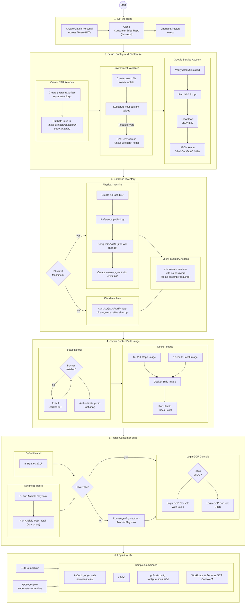

# Docker-based Install Full Flowchart

```mermaid
flowchart TB
    %% Define nodes w/ text
    START((Start))

    REPO0["Create/Obtain Personal<br/>Access Token (PAT)"]
    REPO1["Clone<br/>Consumer Edge Repo<br/>(this repo)"]
    REPO2["Change Directory<br/>to repo"]

    ENV1[Create .envrc file<br/>from template]
    ENV2[Substitute your custom values]
    ENV3["Final .envrc file in<br/>#quot;<em>./build-artifacts</em>#quot; folder"]

    GSA0["Verify <em>gcloud</em> installed"]
    GSA1["Run GSA Script"]
    GSA2["Download<br/>JSON key"]
    GSA3["JSON key in<br/>#quot;<em>./build-artifacts</em>#quot; folder"]

    DOCKER1[Docker Build Image]
    DOCKER0{Docker<br/>Installed?}
    DOCKER_INSTALL[Install<br/>Docker 20+]
    DOCKER2["1a. Pull Repo Image"]
    DOCKER3["1b. Build Local Image"]
    DOCKER4["Run Health<br/>Check Script"]

    INSTALL1A["a. Run <em>install.sh</em>"]
    INSTALL1B["b. Run Ansible Playbook"]
    INSTALL2{"Have<br/>OIDC?"}
    INSTALL3B["Run Ansible Post Install (adv. users)"]
    INSTALL4{"Have Token"}
    INSTALL4A["Run <em>all-get-login-tokens</em><br/>Ansible Playbook"]
    INSTALL5A["Login GCP Console<br/>With token"]
    INSTALL5B["Login GCP Console<br/>OIDC"]

    POST1A["SSH to machine"]
    POST1B["GCP Console<br/>Kubernetes or Anthos"]
    POST2["<em>kubectl get po --all-namespaces</em>💻"]
    POST3["<em>k9s</em>💻"]
    POST4["<em>gcloud config configurations list</em>💻"]
    POST5["Workloads & Services GCP Console🌍"]

    %% Start Groups

    subgraph REPO ["1. Get the Repo"]
        direction LR
        REPO0 --> REPO1
        REPO1 --> REPO2
    end

    subgraph DEV ["2. Setup, Configure & Customize"]
        subgraph SSH ["Create SSH Key-pair"]
            direction TB
            SSH2["Put both keys in <br/><em>./build-artifacts/consumer-edge-machine</em>"]
            SSH1["Create passphrase-less<br/>asymmetric keys"]
            SSH1 --> SSH2
        end

        subgraph ENVVARS["Environment Variables"]
            direction TB
            ENV1 --> ENV2
            ENV2 -->|Populate Vars| ENV3
        end

        subgraph GSA ["Google Service Account"]
            direction TB
            GSA0 --> GSA1
            GSA1 --> GSA2
            GSA2 --> GSA3
        end

        SSH --> ENVVARS
        ENVVARS --> GSA
    end

    subgraph INVENTORY_SETUP ["3. Establish Inventory"]
        subgraph PHYSICAL ["Physical machine"]
            direction TB
            INVENTORY1["Create & Flash ISO"] --> INVENTORY2["Reference public key"]
            INVENTORY2 --> PHYSICAL1["Setup <em>/etc/hosts</em> (step will change)"]
            PHYSICAL1 --> PHYSICAL2["Create <em>inventory.yaml</em> with <em>envsubst</em>"]
        end

        subgraph CLOUD ["Cloud machine"]
            direction TB
            CLOUD1["Run <em>./scripts/cloud/create-cloud-gce-baseline.sh</em> script"]
        end

        subgraph CONNECTION ["Verify Inventory Access"]
            direction TB
            CONNECTION1["ssh to each machine<br/>with no password<br/>(some assembly required)"]
        end

        PHYSICAL_Q{"Physical<br/>Machines?"}
        PHYSICAL_Q -->|yes| PHYSICAL
        PHYSICAL_Q -->|no| CLOUD

        PHYSICAL --> CONNECTION
        CLOUD --> CONNECTION
    end

    subgraph DOCKER ["4. Obtain Docker Build Image "]
        direction LR
        subgraph DOCKER_SETUP["Setup Docker"]
            DOCKER0-->|no| DOCKER_INSTALL
            DOCKER_INSTALL-->DOCKER0
            DOCKER0-->DOCKER5["Authenticate gcr.io<br/>(optional)"]
        end
        subgraph DOCKER_IMAGE ["Docker Image"]
            DOCKER2--o DOCKER1
            DOCKER3--o DOCKER1
            DOCKER1--> DOCKER4
        end
        DOCKER_SETUP --> DOCKER_IMAGE
    end

    subgraph INSTALL["5. Install Consumer Edge"]
        direction LR
        subgraph INSTALL_DEFAULT["Default Install"]
            INSTALL1A
        end
        subgraph INSTALL_ADVANCED["Advanced Users"]
            INSTALL1B --> INSTALL3B
        end

        INSTALL_DEFAULT --> INSTALL4
        INSTALL_ADVANCED --> INSTALL4

        subgraph LOGIN["Login GCP Console"]
            INSTALL2 --> INSTALL5A
            INSTALL2 --> INSTALL5B
        end

        INSTALL4 -->|no| INSTALL4A
        INSTALL4 -->|yes| LOGIN
        INSTALL4A --> LOGIN

    end

    subgraph POST["6. Login / Verify"]
        subgraph SAMPLE["Sample Commands"]
            direction BT
            POST2
            POST3
            POST4
            POST5
        end
        POST1A --> SAMPLE
        POST1B --> SAMPLE
    end

    %% Start primary graph linking

    START --> REPO
    REPO --> DEV
    DEV --> INVENTORY_SETUP
    INVENTORY_SETUP --> DOCKER
    DOCKER --> INSTALL
    INSTALL --> POST

```